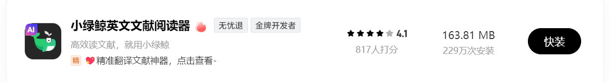
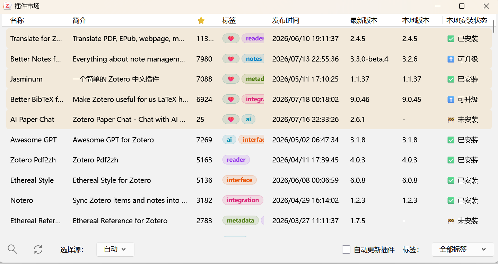
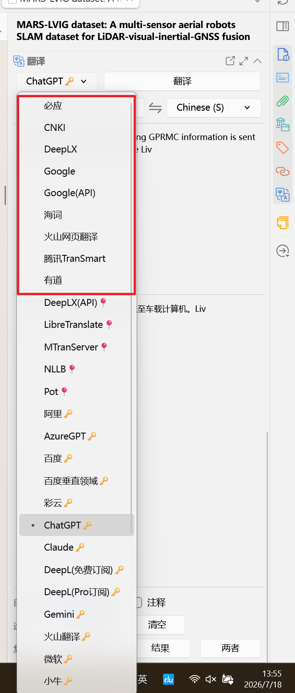
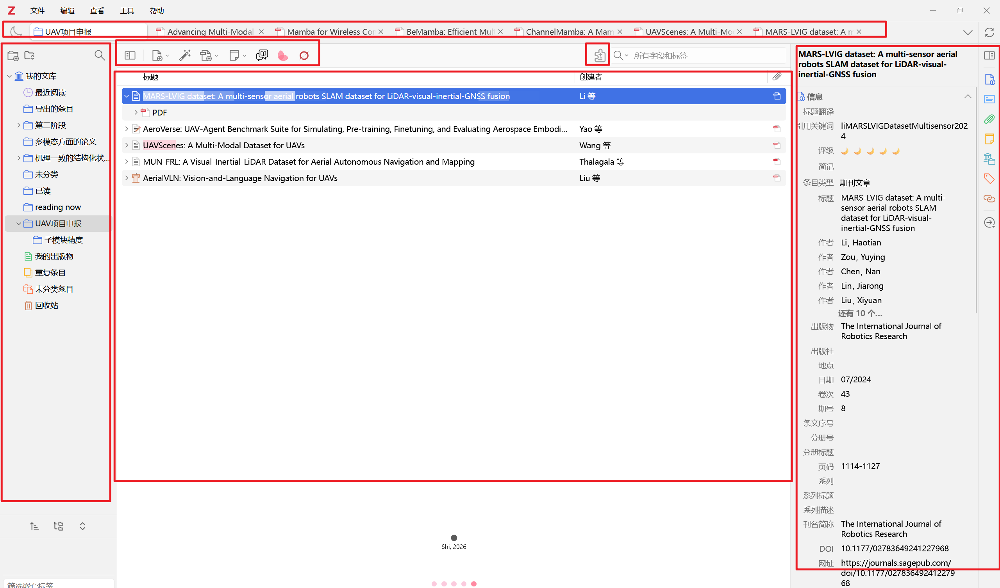
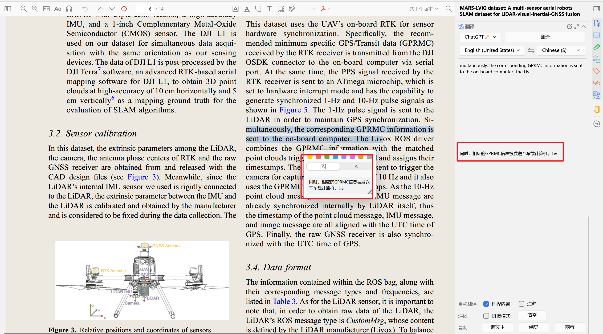

# 阅读论文时的工具选择

在最开始读英文论文的时候，直接用PDF阅读，肯定会是极其吃力的，这时候选择一个好的阅读软件就很重要了。

这里我给大家介绍两款软件，商店里可以直接下，两个各有千秋。

> 一般好的阅读器都有“划词翻译”，“整理文献的功能”。

## 第一款：小绿鲸

特点：好上手，部分功能付费

**使用方法：**把你从数据库下载的PDF，直接拉到小绿鲸就可以了，功能还挺多的，自己多尝试一下子吧。

## 第二款：Zotero

特点：上限功能多，但是不好上手

**使用方法：**使用这个软件，需要动手能力要稍微强一点。但如果会用的话，我个人感觉确实要比小绿鲸好用一点。

这里我直接推荐Zotero好用的配置：

1. 插件市场
2. 直接下载插件市场里高下载量的软件（可以不用管具体作用是啥，下载后慢慢使用的过程中就懂了）

3. 翻译软件如何接入Deepseek的API（也可以是其他大模型的API）。当然你也可以不接入，有免费的不需要接入其他大模型的API，但是我感觉接入的话，翻译的可能会更准确一点。

> 具体配置方法就直接问AI，跟着教程一步一步操作，哪里有问题及时和AI沟通。如果你还有其他好用的插件，也可以自行下载。

配置完成后大致是这个样子：

