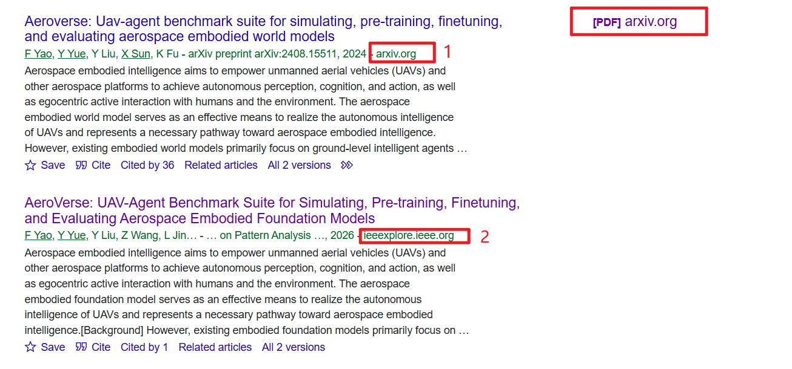

# 如何获取适合的论文

在确定自己的大致研究领域之后，对于一位刚踏足该领域的小白，当下阶段肯定是最迷茫的，不知道从何下手，而在这个时候学会选择适合当下阶段的论文就显得很重要了。

其实不仅是在开始阶段，在我们以后的论文阅读过程中，不一定非要去找最新的、最流行的、最前沿的论文来读。“没有最好的论文，只有最适合的论文”，就像故事一样，故事有没有价值不取决于故事本身，而取决于听故事的人。

## 选择什么类型的论文？

在你踏足新的领域时候，最重要的肯定**不是精，而是广**。最开始阶段，不适宜花太多时间去搞明白一些"细枝末节"的东西，最重要的是对所研究的领域有一个大致的把控(也可以说是“框架”)——最起码要知道，自己要研究的领域是什么呢？自己当下的研究有什么意义在呢？哪些问题没有被解决？针对这些问题，自己有什么大胆一点的想法在(可以记录下来)？

而想要搞明白这些问题，最该读什么类型的论文？——**综述性论文**

## 怎么选择论文？

这时候肯定有人要问了——怎么找最适合的论文？

答：**借助AI**。你可以用Deepseek的专家模型，也可以用Calude，也可以用ChatGPT，你可以直接把你想了解的领域发给它们，先让它们给一个该领域的框架，有哪些没有被解决的问题，然后再让它们给你推荐一些适合你的论文。(这里不用纠结国内的模型还是国外的模型，对你当下阶段是没有太大区别在的，重心别放错)

> 补充一点，好的论文大多是英文写的(包括中国作者的论文也是)，所以我建议一开始就去看英文的论文。

## 如何查找论文？

(默认你会翻墙)

最简单、最暴力、最直接、最一针见血的、最接地气的、最真实的方法就是——[谷歌学术](https://scholar.google.com/)

直接把你想要下载的论文题目放到搜索框就行。

一般会面临两种情况：

- 作者上传到了预印版论文库[arxiv]([Search | arXiv e-print repository](https://arxiv.org/search/?query=Deep+Joint-Semantics+Reconstructing+Hashing+for+Large-Scale+Unsupervised+Cross-Modal+Retrieval&searchtype=all&abstracts=show&order=-announced_date_first&size=50))上了。如1
- 作者可能没有上传预印版的情况，就只能在[IEEE](https://ieeexplore.ieee.org/Xplore/home.jsp)或者其他网站(如，[semantic-scholar]([Semantic Scholar | AI-Powered Research Tool](https://www.semanticscholar.org/)))上下。如2

像IEEE和semantic-scholar收费与否取决于你们学校是否购买该论文库，一般来说，很多学校（非92）是不会去买的，除了工科强校，比如，河理工一类的学校。

> 不着急埋怨你的学校，主要是这些论文库都是外国的。更折磨人的是它会看人下菜，根据不同人收不同价位。。。

但也不要灰心，很多作者现在都会把自己的论文提前上传到预印版网站arxiv。

你还可以使用其他盗版的网站，比如SCI-Hub等。(选红色★图表的那个)

当然还有另外一种方法：

找你的92同学，直接用它们的学号、密码登录那些付费的论文库。(截止到目前，是可行的，但是之后不知道是否可行)

