## 选择合适的算力平台

算力平台的选择因人而异，这里不做要求，更不会做推荐。


有条件的科研人，可以看看自己学校有没有免费超算平台，可以薅下羊毛，而研究生的话一般学校/导师给报销的。


这里对于刚入门的同学的话，我推荐[AutoDL算力云](https://www.autodl.com/) ，以下流程也是依据这个平台来写的（如果以后长期使用该平台，可以注册个学校邮箱，搞个学生认证，开始也会送30天的会员。不喜欢的话换其他平台也可以，依据个人喜恶选择。）

## 选购合适的配置

可以让你之前配置好的`claude+deepseek`读取一下你要上传的文件，看选择一下用什么配置性价比高。


一般来说常见的一个GPU的RTX 3090 都几乎够入门，新手尽量别使用VGPU（性能损失显著、存在隐藏缺陷、配置复杂且成本效益低。）。


## 准备上传数据到云端电脑

当然肯定还有其他更快的方法，是可以不先把数据集和代码集下载到本地上的。但是对于新手，还是应该有最基础的练习。

**强烈建议方式一、二都亲手实操一下。**

### 方式一:本地 → autodl-fs共享云盘→autodl-tmp

#### 压缩文件

为了文件传得快、传得稳、好管理，**务必压缩**，养成习惯。


推荐APP（联想商店里有，下载完这个后，你电脑上的其他压缩软件可以直接删掉 :smile:）


由于训练模型时，数据集一般都比较大，而针对于不同的数据集，应采用不同程度的压缩。


对于非图片可以采用严格形式的压缩，但是对于图片（平时见到的绝大多数图片格式，**本身就内置了压缩算法**），再采用严格的压缩，意义不大，这种一般就只打包就行(压缩了反而超级费时间)。

| 你的文件类型                   | 直接上传？           | 仅打包不压缩（ZIP/存储模式）？ | 打包+压缩（ZIP/普通模式）？  |
| :----------------------------- | :------------------- | :----------------------------- | :--------------------------- |
| 很多 `.txt` / `.csv` / `.json` | ❌ 不推荐             | ⚠️ 可以，但浪费                 | ✅ **强烈推荐**               |
| 很多 `.jpg` / `.png`**图像**   | ❌ 不推荐（容易失败） | ✅ **推荐**                     | ⚠️ 可以但没压缩收益，浪费时间 |
| 混合（文本+图片）              | ❌ 不推荐             | ✅ 推荐                         | ✅ 推荐（文本部分会受益）     |
| 单个巨大的 `.mp4`              | ✅ 可以               | ❌ 没必要                       | ❌ 没必要（无收益）           |
| 单个巨大的 `.bmp`              | ⚠️ 可以               | ⚠️ 一般                         | ✅ **推荐**（体积会显著变小） |


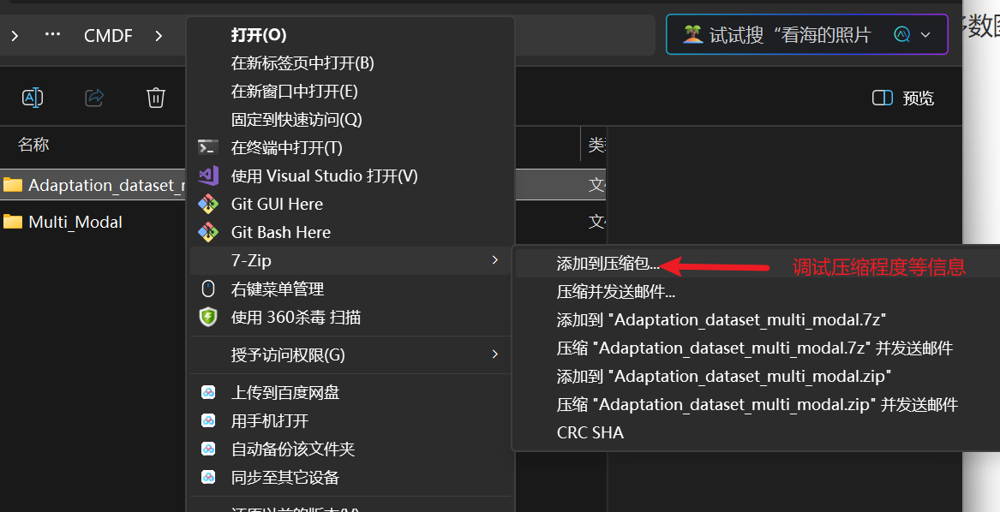


tips:打包时，如果你打包后的文件夹过大（远超过5GB），建议是**分开打包**。看情况，尽可能维持在5GB左右。


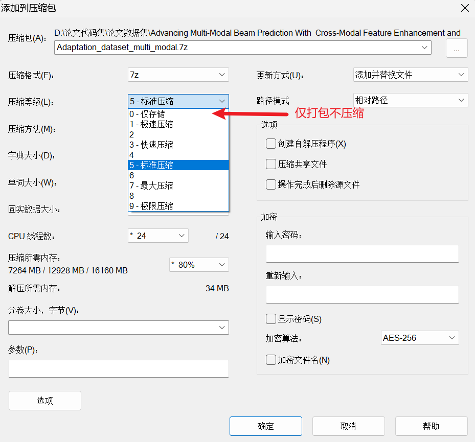

#### 提前上传文件到平台云盘

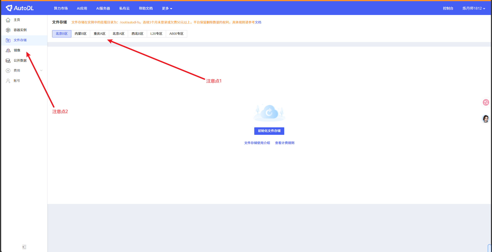

- 注意点1：这里对于不同区的选择一定要慎重，一般按照优先级考虑以下几点：
  - 选择的区一定要和接下来你购买的算力所在位置相对应。（eg.买的是内蒙B区的GPU实例，就需要提前把压缩打包好的文件提前上传到内蒙B区）
  - 不同区域的服务器物理位置不同，和你本地网络的连接质量也不同。一般来说离你越近，质量越好，上传文件就越快。（eg.北方的同学，用北京B区和内蒙B区就会比较好一点。）
- 注意点2：镜像相当于预先配置好CUDA、PyTorch等深度学习框架和工具的“操作系统模板”，让你租用实例后无需手动装环境，开机就能直接跑代码。


初始化文件存储后就可以上传你的压缩包。

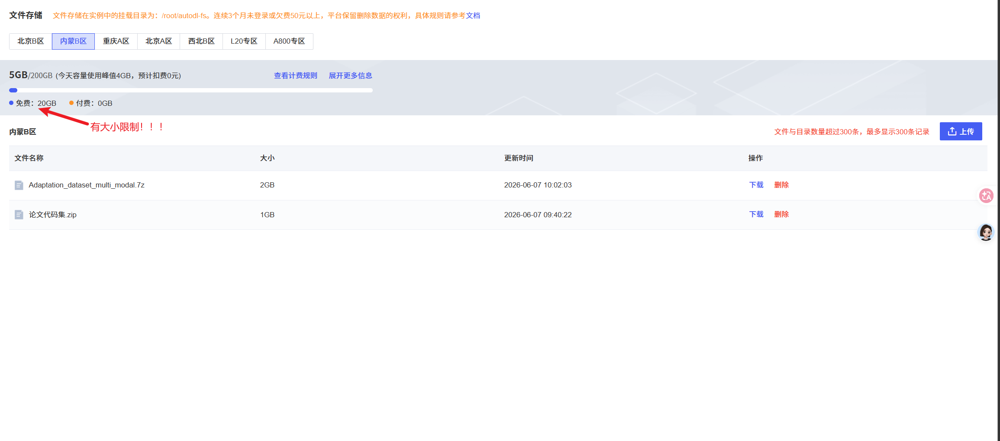


由于免费的存储空间有大小的限制。所以上传的时候就需要注意：

1. 单次文件大小不要超过20GB
2. 可以边传输文件到AutoDL的云盘，边在一会儿购买的实例中解压文件（解压后把原来云盘中的压缩包删除）。（详细步骤在下面）

#### 上传数据到实例中

##### 第一步：下载安装 WinSCP（免费）

浏览器打开官网：[https://winscp.net/eng/download.php](https://link.wtturl.cn/?target=https%3A%2F%2Fwinscp.net%2Feng%2Fdownload.php&scene=im&aid=497858&lang=zh)

下载【Free Download】免费版。

##### 第二步：购买GPU实例

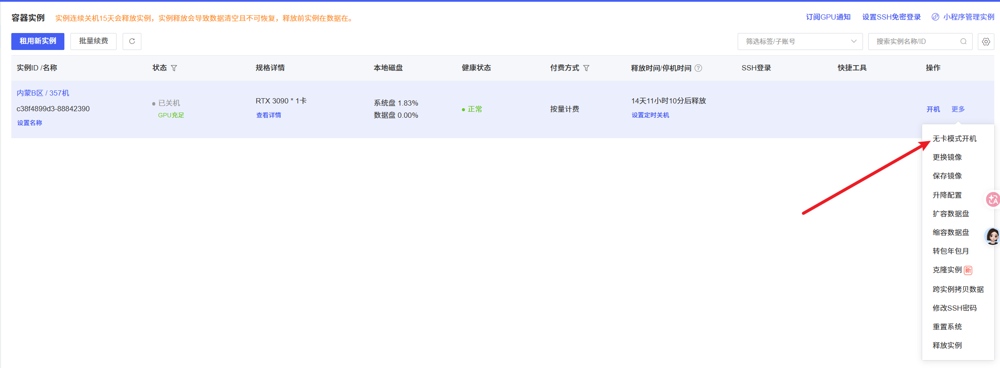

注意购买后，<u>**立即关机**！！！</u>


传输数据的时候，采用不调用GPU的`无卡模式开机`。


等待开机，云盘文件会自动挂载到实例文件夹 `/root/autodl-fs`

##### 第三步：建立本地和云端电脑的链接

准备新建站点：

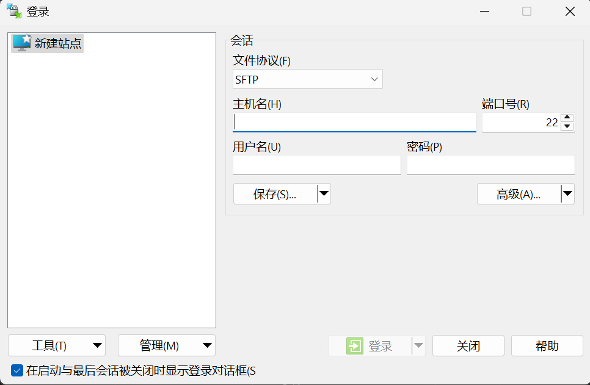


```
比如：
登录指令：ssh -p 21234 root@connect.nmb2.seetacloud.com
密码：Mlej+oTEo7Ft

其中
主机号：@connect.nmb2.seetacloud.com
端口号：21234
用户名：root
密码:Mlej+oTEo7Ft
```

之后点【保存】→【登录】，弹窗点确认信任密钥。


##### 第四步：准备解压

$先补充另外一个上传文件到实例的方式：$

- 左侧 = 你自己电脑本地文件夹*
- 右侧 = AutoDL 云服务器目录

1. 右侧点开：`/root/autodl-fs`（必须传这里！确保关机数据不丢失。系统盘不能存大数据，**如果没有这个文件夹就自己创建一个**,但一般只要你刚刚创建了平台的云盘，这个就是自动生成的）
2. 左边找到你本地**提前压缩好的 zip 数据集**，鼠标按住直接拖到右边空白处，开始上传。（当然这种上传方式，仅限于**较小的文件**）

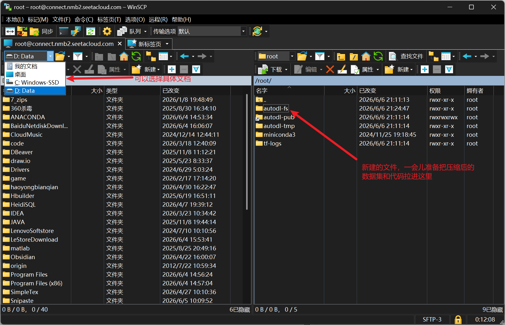

###### 方式一：在WinSCP终端

SSH 登录无卡实例后，打开WinSCP左上角的终端，执行命令：

```
# 安装7z专属解压工具
apt update && apt install p7zip-full -y

# 进入云盘目录，不要重复进入，重复进入会报错。（还是不行就问豆包）
cd /root/autodl-fs

# 解压7z文件（-x 表示解压）
7z x Adaptation_dataset_multi_modal.7z


# 把解压好的数据全部移动到实例本地盘（autodl-tmp，不占云盘空间，方便之后删除）
mv 解压后的文件夹名 /root/autodl-tmp/
```

| 目录               | 本质               | 空间限制                       | 读写速度 | 数据保留规则                                                 |
| ------------------ | ------------------ | ------------------------------ | -------- | ------------------------------------------------------------ |
| `/root/autodl-fs`  | 文件存储网盘挂载点 | 免费 20GB，超出计费            | 较慢     | 永久保存，不受实例开关机影响。<br />可以跨实例共享，和云盘共用。 |
| `/root/autodl-tmp` | 实例本地数据盘     | 随实例配置而定（你这里是 50G） | 非常快   | 实例释放才会清空，开关机不会消失                             |

###### 方式二：在JupyterLab的终端

大致流程和方式一几乎一样，只不过输入的位置不一样。

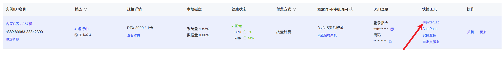

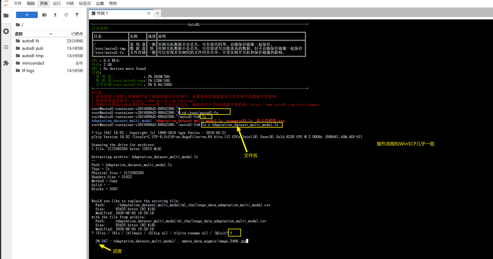


❌ 不要数据直接放 root 根目录：系统盘空间很小容易爆满停机

:rocket:别忘把解压好的数据全部移动到实例本地盘（`autodl-tmp`，不占云盘空间，方便之后删除），
在`autodl-fs`文件夹下执行$\to$ `mv 解压后的文件夹名 /root/autodl-tmp/`


以`rsync -avP 文件名 /root/autodl-tmp/`这种复制式的移动也可以。（推荐这种方式，这种方式可以观看进度条。上面那种方式容易中断。）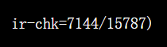


### 方式二：本地 → 公网 SSH → 实例本地盘 autodl-tmp

#### 1.下载WSL

Win+X → 选 **Windows PowerShell (管理员)** 或 **终端 (管理员)**。

```powershell
wsl --install -d Ubuntu --web-download
```

（下载的慢的话就开加速器）

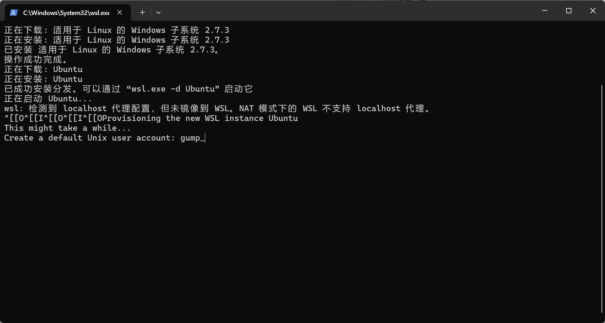

屏幕提示 `Create a default Unix user account:` 后面已经有 `gump_` 了，按下面做：

1. 直接按回车，就用 `gump_` 作为你的 Ubuntu 用户名

2. 接下来会提示输入密码（输入时

   屏幕不会显示任何字符

   ，正常现象）

   - 输入一个你能记住的密码（比如 `123456`，生产环境不建议这么弱，但自己用没问题）
   - 再输入一次确认密码

3. 密码设置完成，就进入 Ubuntu 命令行。


#### 2.先装 rsync 和 SSH 客户端（传文件必备）


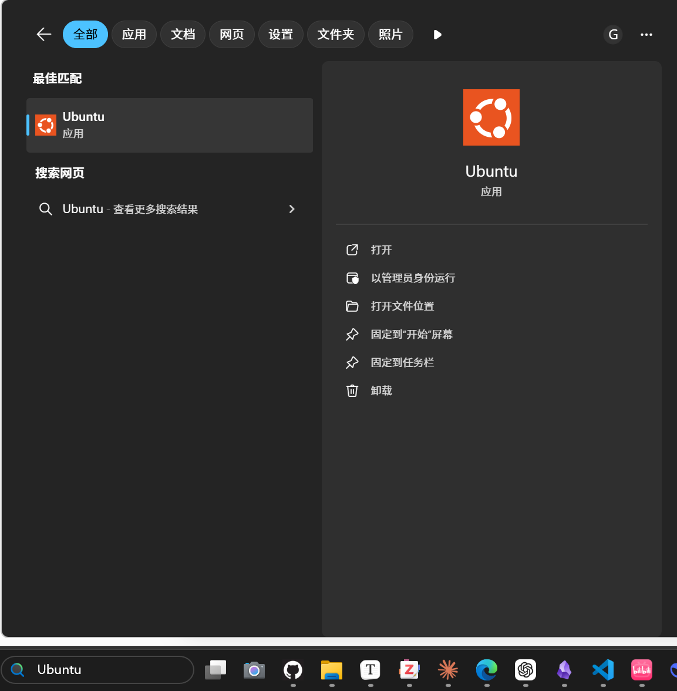

在 Ubuntu 终端里执行这两条命令：

```bash
sudo apt update
sudo apt install -y rsync openssh-client
```

- 输入你刚设置的用户密码，回车执行
- 装完这两个工具，你就可以用 `rsync` 传文件了

装完这两个工具，你就可以用 `rsync` 传文件了


#### 3.先测试 SSH 能不能连上 AutoDL（关键！）

把下面命令里的 `主机地址` 和 `端口` 换成你 AutoDL 实例的信息(在你的实例中查看`ssh`中查看)：


比如`ssh -p 21234 root@connect.nmb2.seetacloud.com`

```bash
ssh root@你的AutoDL主机地址 -p 你的端口号
ssh  root@connect.nmb2.seetacloud.com -p 21234
password是你再AutoDL上的密码。不是之前的Linux的密码。
```

成功界面$\to$


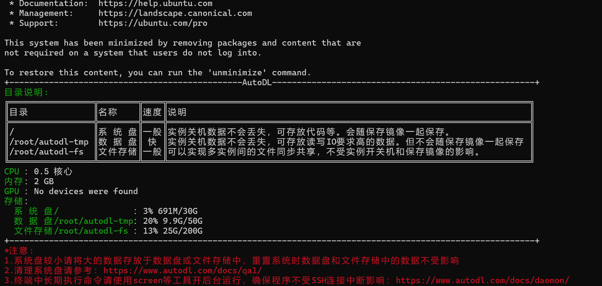

#### 4.执行 `rsync` 上传（核心操作）

<u>**打开新的WSL (Ubuntu)终端！！！！**</u>

执行下面的命令（把路径改成你自己的）：

通用模板

```bash
rsync -avzP -e "ssh -p 21234" "/mnt/你的Windows路径/" root@connect.nmb2.seetacloud.com:/root/autodl-tmp/
```

关键参数说明

- `-a`：保留文件权限、目录结构
- `-v`：显示传输过程
- `-z`：传输时压缩（对小文件 / 文本特别快）$\to$如果说你已经按照我的建议，把文件压缩好了，**<u>`avzp`里的`z`这个参数直接删去！！！</u>**
- `-P`：显示进度条 + **断点续传**（断了重跑会自动继续）
- `/mnt/你的Windows路径/`：末尾的 `/` 很重要，表示只传文件夹内的内容，不会额外嵌套一层目录


> **Note:**
>
> :warning:注意上传到路径一定要写对！！！
>
> WSL是Linux系统，路径写法和windows系统有所不同。（不放心的话，直接让豆包帮你转换成符合要求的WSL指令路径。）
>
> - `D:\` → `/mnt/d/`
> - `\` → `/`
> - **空格保留，整段用双引号包起来**
>
> 转化后路径可以用  `ls "/mnt/转换的路径/"`在WSL终端上验证一下。


 示例（假设你要传 `"D:\scenario32"`）

```bash
rsync -avzP -e "ssh -p 21234" "/mnt/d/scenario32/" root@connect.nmb2.seetacloud.com:/root/autodl-tmp/
```


#### 5.传输完成后，必做的校验

上传结束后，在 **AutoDL 实例终端** 里运行命令，确认数据完整：

```bash
du -sh /root/autodl-tmp/scenario32
```

对比一下这个大小和你本地文件夹的大小，一致就说明传输成功了。

#### 6.执行正常的解压。

方式一中有写。


> [tips] 
>
> 可以同时开多个终端，上传多个文件到云端。


## 总结

本文主要主要介绍了三种传输数据到云端的方式

|                                         | 适应范围   | 速率 |
| --------------------------------------- | ---------- | ---- |
| WinSCP直接拉到云端电脑                  | 小文件     | 一般 |
| 本地 → autodl-fs共享云盘→autodl-tmp     | 适合大文件 | 快   |
| 本地 → 公网 SSH → 实例本地盘 autodl-tmp | 适合大文件 | 快   |


本文还介绍了对大文件的打包/压缩方面的知识，以及解压/移动文件的知识。


至于以后，还有更快的方法。

> 在有些情况下，是不用把数据集下载到本地，甚至可以绕过从本地上传的步骤，直接从网盘/网站上导入数据集的。
>
> 也可以直接用AutoDL平台上已有的数据集进行训练。

但无论如何这种最基本的传输文件到云端的形式，虽然笨拙，但是的的确确是入门科研的人必须要走的一步，当其他方法不行的时候，你会发现这种方法的确很好用。


