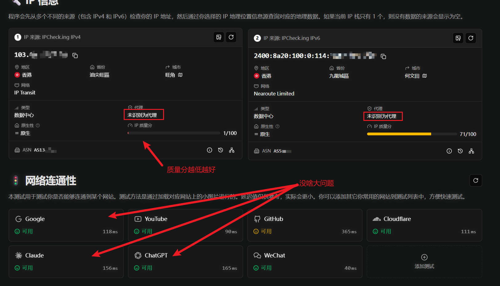
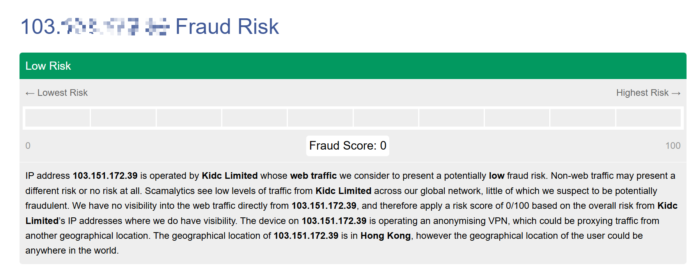

:rocket:本文不会提供任何关于如何科学上网的流程，在任何传播翻墙的路径都是违法的！！！


为了提高法律意识，需要给大家的提醒$\to$

```tex
《计算机信息网络国际联网管理暂行规定》第 6 条、第 14 条：

“计算机信息网络直接进行国际联网，必须使用邮电部国家公用电信网提供的国际出入口信道。任何单位和个人不得自行建立或者使用其他信道进行国际联网。”
这是最常见的行政处罚依据，通常处以警告或罚款，并没收违法所得。

《中华人民共和国刑法》第 285 条第 3 款（提供侵入、非法控制计算机信息系统程序、工具罪）：
如果你的教程或工具被大量下载、转发，或者你通过求赏、售卖节点、挂广告等方式赚了钱（哪怕只有几百块），就极易触犯刑法，演变成刑事案件。
```


如何找到干净而便宜的梯子？

我推荐是私下找你的同学寻求帮助，看他们使用的节点，是否便宜，梯子里面的节点是否**干净**。

（节点干净很重要，不干净的话，你之后使用谷歌账号，极其容易被封号！）


怎样判断节点是否干净？

- 看价格：一般价格在10￥左右一个月的相对来说是比较干净的节点。
- 看弹窗与否：在登录谷歌账号后的使用过程，完全不弹验证码，那就是相对干净的。
- 网站测试：先把你梯子的代理打开。
  - 如果已经有了谷歌账号$\to$https://ipcheck.ing/ 这里的IPV4和IPV6一般都不用管，这种的就是干净的。
  - 如果没有谷歌账号$\to$
    先用上面的网址得到你的梯子的IP地址。然后把网址输入https://scamalytics.com/这个网站进行测试。


除此以外，读者还需要有的**注意事项**：


1. 你可以把自己翻墙路径给有科研需要的同学，而一个梯子一般是可以供5个人同时使用，所以可以几个人一块A钱。但绝对不要在任何群聊中传播翻墙路径，更不要给陌生人！
   
2. 不要用校园网等一系列公域网！就用自己的流量。使用的过程，不要来回切换节点，切换过于频繁也容易封谷歌账号。
   
3. 有辨识能力。翻墙之后外国人发的，有关一切抹黑咱们国家的不要信！更不要去点赞、评论！！！
   
4. 别当沙杯。


推荐的网站：

https://claude.ai/ $\to$Claude

https://chatgpt.com/ $\to$ChatGPT

https://gemini.google.com/ $\to$Gemini

